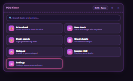
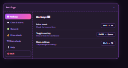
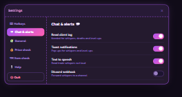
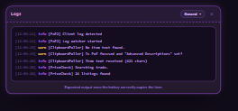
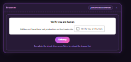

<div align="center">


# POE Kitten

**An overlay for Path of Exile 2 that prices your items, reads trade whispers, and stays out of your way.**

<br />


</div>

---

POE Kitten floats over Path of Exile 2 as a transparent overlay. Hover an item,
press a key, and you get live trade listings without ever leaving the game. The
game keeps focus; the overlay never steals your input.

It is built as a **desktop overlay first** — not a website in a window, not a
companion app you alt-tab to.

## What it does

| | |
|---|---|
| **Price check** | Copy any item with one hotkey. POE Kitten parses it and pulls live listings, with a median price and whisper buttons. |
| **Session HUD** | A small always-on panel for the numbers you actually track while playing. |
| **Overlay controls** | Global hotkeys, hide-on-blur, and a window that stays out of the way. |
| **Auto-update** | Checks on launch and every 16 hours, then prompts you in-app. |

## Screenshots

<div align="center">



<br />




<br />




</div>

## Download

**The only official download location is
[github.com/HakkuPantsu/poe-kitten/releases](https://github.com/HakkuPantsu/poe-kitten/releases).**
Anything else is unofficial and may be unsafe.

| Platform | File |
|---|---|
| Windows (installer) | `POE-Kitten-Setup-*.exe` |
| Windows (portable) | `POE-Kitten-*.exe` |
| macOS | `POE-Kitten-*.dmg` |
| Linux | `POE-Kitten-*.AppImage` |

## Getting started

1. **Launch Path of Exile 2 once.** The game writes the log files POE Kitten
   reads. Without that first run there is nothing to read.
2. **Start POE Kitten.** It lives in the system tray.
3. **Open the settings** (`Shift` + `Space` by default) and turn on
   **Read client log**.
4. **Price an item.** Hover it in-game and press `Ctrl` + `F6`.

Both hotkeys are rebindable in Settings.

## How it works

```
┌─ Electron main ────────────────────────────────────┐
│  global hotkeys · overlay window · clipboard       │
│  game log watcher                                  │
└───────────────┬────────────────────────────────────┘
                │  websocket
┌───────────────▼────────────────────────────────────┐
│  renderer (Vue 3)                                  │
│    parser  ──  clipboard text -> typed item        │
│    trade   ──  item -> query -> listings           │
│    UI      ──  overlay + dashboard                 │
└────────────────────────────────────────────────────┘
```

The main process owns the hotkeys and watches the game log. When you price-check
something it hands the clipboard text to the renderer, which parses it into a
typed item and builds a trade query from its mods.

## Development

Requires **Node 24**.

```bash
git clone https://github.com/HakkuPantsu/poe-kitten
cd poe-kitten

(cd renderer && npm install)
(cd main && npm install)
```

Run the app — this starts the Vite dev server and launches Electron against it:

```bash
cd main
npm run dev
```

Other useful commands, from `renderer/`:

```bash
npm run check-types   # vue-tsc over the whole project
npm run test          # vitest
npm run build         # typecheck + production bundle

MOCKUP=1 npx vite build   # build the standalone UI mockup to mockup-dist/
```

See [DEVELOPING.md](./DEVELOPING.md) for the full setup, and
[docs/](./docs) for the user documentation site.

## Technology

| Layer | |
|---|---|
| Shell | Electron 40 |
| Overlay | [`electron-overlay-window`](https://github.com/SnosMe/electron-overlay-window) |
| UI | Vue 3 + Vite, Tailwind v4 |
| Design | shadcn-style component kit, hand-written |
| Parser | TypeScript, ported from the Awakened PoE Trade lineage |
| Data | Python pipeline in [`dataParser/`](./dataParser) |

## Status

POE Kitten is in **beta**. The overlay, price check and parser are working. The
insights and settings screens are still being built out — expect rough edges,
and please report them.

The beta UI lives on the [`beta`](https://github.com/HakkuPantsu/poe-kitten/tree/beta)
branch until it is ready to replace the current release.

## Contributing

Issues and pull requests are welcome. For anything larger than a bug fix,
please open an issue first so we can agree on the approach before you write it.

## Licence

MIT — see [LICENSE](./LICENSE).

POE Kitten is an independent project. It is not affiliated with or endorsed by
Grinding Gear Games. Path of Exile is a trademark of Grinding Gear Games.
