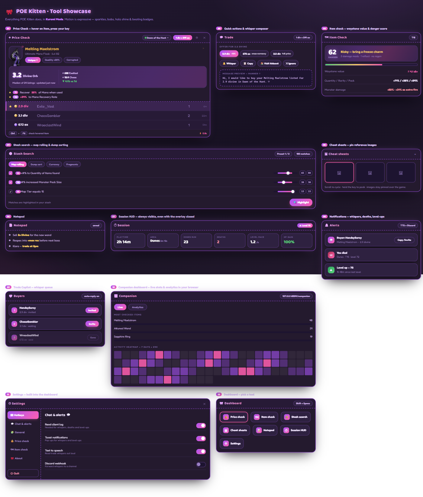

#  POE Kitten

A modern, all-in-one Path of Exile 2 overlay — Kuromi Mode themed, with price checks,
map checks, stash search, cheat sheets, a notepad, an always-on session HUD and a
browser companion dashboard with analytics.

- **Based on** [Exiled Exchange 2](https://github.com/Kvan7/Exiled-Exchange-2) by [Kvan7](https://github.com/Kvan7)
- **Created by** [HakkuPantsu](https://github.com/HakkuPantsu)
- **For** SirMelvinTheNonce (inspiration)

The ONLY official download site is <https://github.com/HakkuPantsu/poe-kitten/releases>, any other locations are not official and may be malicious.

## Download

1. Download the latest release from [releases](https://github.com/HakkuPantsu/poe-kitten/releases)
   - `POE-Kitten-Setup-0.0.1.exe` — installer (one-click setup)
   - `POE-Kitten-0.0.1.exe` — portable, no install, just run it
2. Run it
3. Launch Path of Exile 2 at least once so it creates its log files
4. In POE Kitten, open the dashboard (`Shift` + `Space`) → Settings and turn on **Read client log**

## Updating

POE Kitten checks GitHub releases on startup and every 16 hours. When an update
is available you'll be prompted in the app — no need to download manually.

## Tool showcase

### Development

See [DEVELOPING.md](./DEVELOPING.md)

### Acknowledgments

- [Exiled Exchange 2](https://github.com/Kvan7/Exiled-Exchange-2) — the project POE Kitten is forked from
- [awakened-poe-trade](https://github.com/SnosMe/awakened-poe-trade) — the original overlay this lineage descends from
- [libuiohook](https://github.com/kwhat/libuiohook)
- [RePoE](https://github.com/brather1ng/RePoE)
- [poeprices.info](https://www.poeprices.info/)
- [poe.ninja](https://poe.ninja/)

Full list of upstream authors: [CREDITS.md](./CREDITS.md)
